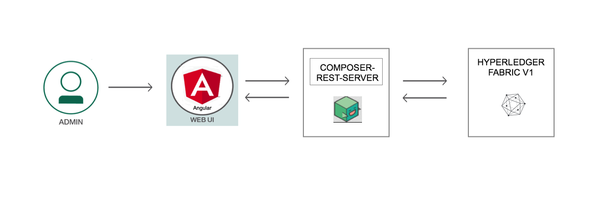

# Decentralized Energy with Hyperledger Composer

A key application of Blockchain being currently explored is a Decentralized Energy network. The idea stems from a neighborhood where certain Prosumers are producing energy through Solar panels or other means, and can sell excess energy to Prosumers needing energy. The transactions would be based on coins in each Prosumer's account. As per a pre-determined contract and rate, the coins would be debited from the consumer and credited to the producer, for a certain billing period. Each transaction would need to be atomic and added to a Blockchain ledger for trust and verification. 

In this code pattern, we will create such a Blockchain application using Hyperledger Composer. The network consists of Residents, Banks and Utility Companies. Prosumers can exchange coins for energy among each other.  The application assumes a pre-paid system where transactions occur after the energy is consumed and the values are updated. 

This code pattern is for me to look to start building Blockchain applications with Hyperledger Composer during my internship in SAP. When I have completed this code pattern, I understand how to:

* Create business network using Hyperledge Composer and recording transactions on Blockchain ledger
* Deploying the networking to an instance of Hyperledger Fabric
* Building an Angular app to interact with the network through REST API

# Architecture Flow

  

1. The administrator interacts with Decentralized Energy UI comprising of Angular framework
2. The application processes user requests to the network through a REST API.
3. Implements requests to the Blockchain state database on Hyperledger Fabric v1
4. The REST API is used to retrieve the state of the database
5. The Angular framework gets the data through GET calls to the REST API

# Included Components

* Hyperledger Composer
* Angular Framework
* Loopback

# Running the Application

## Prerequisite
- Operating Systems: Ubuntu Linux 14.04 / 16.04 LTS (both 64-bit), or Mac OS 10.12
- [Docker](https://www.docker.com/) (Version 17.03 or higher)
- [npm](https://www.npmjs.com/)  (v5.x)
- [Node](https://nodejs.org/en/) (version 8.9 or higher - note version 9 is not supported)
  * to install specific Node version you can use [nvm](https://davidwalsh.name/nvm)
- [Hyperledger Composer](https://hyperledger.github.io/composer/installing/development-tools.html)
  * to install composer cli
    `npm install -g composer-cli`
  * to install composer-rest-server
    `npm install -g composer-rest-server`
  * to install generator-hyperledger-composer
    `npm install -g generator-hyperledger-composer`
